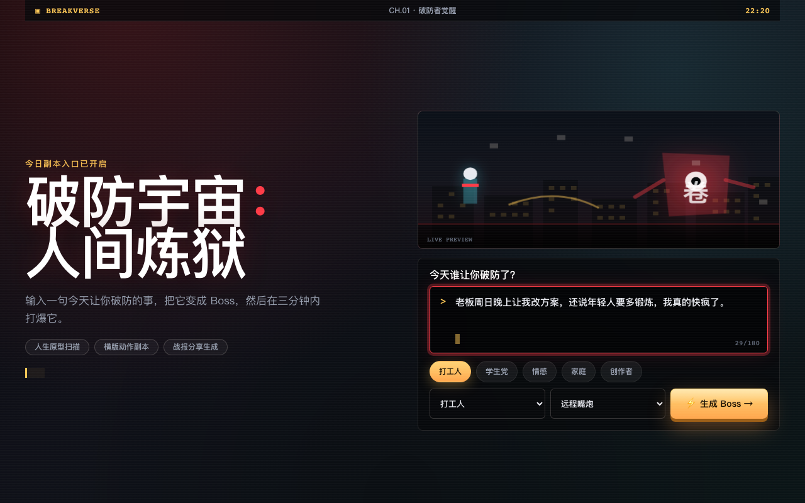
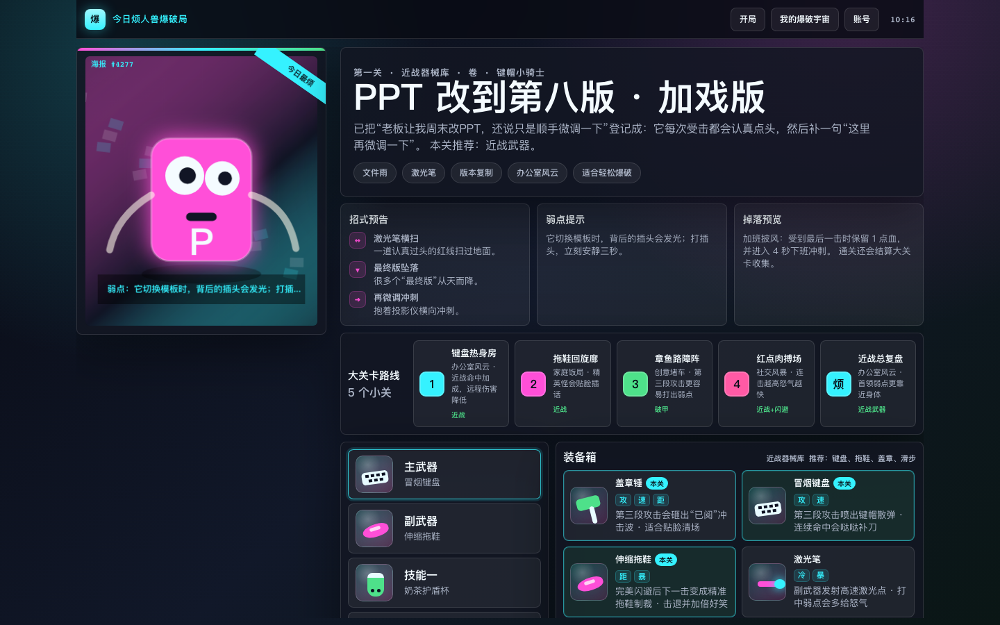
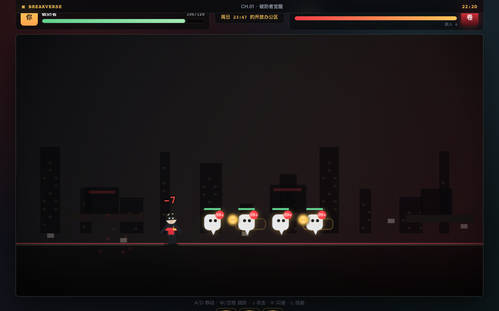
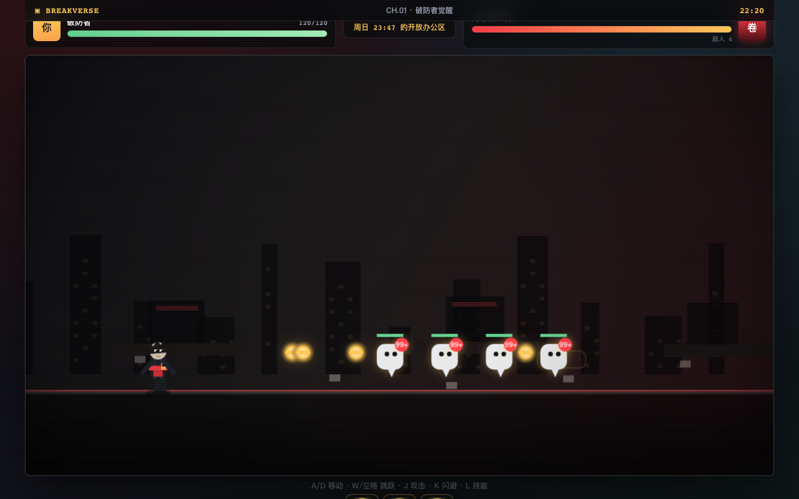

# 破防宇宙：人间炼狱 · BREAKVERSE

> 把今天让你破防的事变成 Boss，三分钟内打爆它。  
> HD Pixel × 暗黑喜剧 × 舞台灯光 × 情绪超现实主义

---

## 这是什么

一个职场情绪横版动作游戏的 Web Demo。输入一句吐槽 → AI 匹配人生原型 → 生成 Boss → Canvas 实时战斗 → 结算分享。当前版本是一个自包含的 HTML 文件（~2,100 行），双击浏览器即可运行。

**核心闭环**：输入吐槽 → Boss 档案 → 横版战斗（3 波）→ 战报分享

---

## 快速开始

```bash
# 法一：直接双击 index.html
open index.html

# 法二：本地服务器（推荐，避免 file:// 跨域限制）
python3 -m http.server 4173
# 浏览器打开 http://localhost:4173
```

无需安装、无需构建、无外部依赖。一个文件跑全部。

---

## 游戏截图

| 首页 · 输入吐槽 | Boss 档案 · 通缉令 |
|:---:|:---:|
|  |  |

| 战斗 · Canvas 横版动作 | 结算 · 战报分享 |
|:---:|:---:|
|  |  |

---

## 操作说明

### 桌面端（键盘）
| 按键 | 动作 |
|------|------|
| `A` / `D` 或 `←` / `→` | 左右移动 |
| `W` / `空格` / `↑` | 跳跃 |
| `J` | 轻攻击（近战横斩） |
| `K` | 闪避（短暂无敌帧） |
| `L` | 技能（远程弹幕） |

### 移动端（触控）
屏幕宽度 < 920px 时自动显示六键触控面板：← → 跳 攻 闪 技

---

## 游戏流程

```
┌──────────┐    ┌──────────┐    ┌──────────┐    ┌──────────┐
│  首页    │ →  │ Boss档案 │ →  │  战斗    │ →  │  结算    │
│ 输入吐槽  │    │ 通缉令   │    │ 3波关卡  │    │ 战报分享  │
│ 选择身份  │    │ 技能预览  │    │ Canvas   │    │ 下载PNG  │
└──────────┘    └──────────┘    └──────────┘    └──────────┘
```

### Wave 1 · 微信 99+
漂浮聊天气泡小怪，远处发弹幕，靠近后逃跑。死亡爆成已读碎片。

### Wave 2 · PPT 激光校对
半人半投影仪精英怪，站桩蓄力红色激光横扫。攻击后过热窗口期。

### Wave 3 · Boss 周末吞噬者
- **P1**（100%-66%）：PPT 激光扫射
- **P2**（66%-33%）：全员会议封印（坠物 + 弹幕），PPT 翅膀展开
- **P3**（33%-0%）：周末突袭冲刺，攻击频率提高

---

## 美术方向

```
HD Pixel + Dark Comedy + Stage Lighting + Emotional Surrealism
```

| 元素 | 说明 |
|------|------|
| **主色调** | 深夜蓝黑 `#07080a` + 高饱和破防红 `#ff3b47` |
| **强调色** | 荧光幕绿 `#62d28f` · 社死粉 `#b596ff` · 金橙 `#ffc857` |
| **角色风格** | 像素艺术程序化绘制（长发围巾主角/气泡怪/投影仪精英/打卡机Boss） |
| **UI 风格** | 游戏操作系统感——终端输入/通缉令档案/战报卡/HUD 战斗仪表 |
| **参考** | Dead Cells 动作清晰度 + Persona 5 UI 戏剧感 + 舞台灯光层次 |

---

## 当前 Boss 原型库

| Boss | 主题 | 触发关键词 |
|------|------|-----------|
| 周末吞噬者 | 职场 | 老板、加班、PPT、KPI、方案 |
| 回忆倒放机 | 情感 | 前任、分手、暧昧、冷暴力 |
| 截止日期追猎者 | 校园 | 考试、论文、deadline、答辩 |

---

## 技术架构

```
index.html
├── <style>          ~900 行 CSS（设计系统 + 4 页全样式）
├── <body>           ~300 行 HTML（品牌条 + 4 屏 + 加载层）
└── <script>         ~900 行 JS
    ├── Screen Manager   页面路由 + 暗场过渡
    ├── Boss Generator   关键词匹配 → 原型选择 → 档案渲染
    ├── Battle Engine    物理/碰撞/状态机/波次/AI
    ├── Canvas Render    背景视差/角色/Boss/特效/HUD
    ├── Effects System   粒子/震屏/hit-stop/闪白/火花/伤害数字
    └── Audio            Web Audio API 打击音效
```

---

## 后续方向

参见 `docs/` 下的升级规划文档：
- **P0**：替换程序化角色为真实 sprite sheet 资产
- **P1**：模块化拆分（spriteAnimator / bossPatternController / combatResolver）
- **P2**：3 主题 × 3 Boss × 完整关卡
- **P3**：Unity 2D URP 产品化

---

## 更新记录

| 版本 | 日期 | 内容 |
|------|------|------|
| `v0.1.0` | 2026-05-05 | 初始原型：完整视觉设计升级，4 页全流程（首页 / Boss 档案 / 战斗 / 结算），Canvas 横版战斗引擎可玩，3 波关卡 + Boss 3 阶段 AI |
| `v0.1.1` | 2026-05-05 | 新增 `server.py` 本地开发服务器（端口 4173，禁用缓存） |
| `v0.1.2` | 2026-05-05 | README 新增游戏截图（4 张，覆盖完整流程） |

---

## 许可

MIT License · 原型阶段，仅供学习与展示

---

*"不是所有崩溃都要忍着，有些可以被打败。"*
